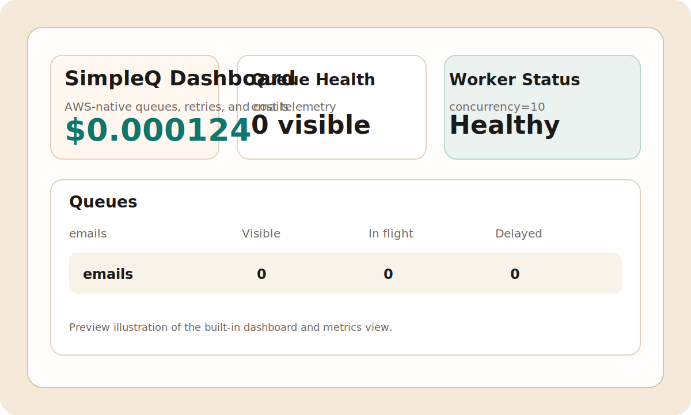

# SimpleQ

SimpleQ is the Python task queue for AWS SQS: async-first, SQS-native, and intentionally small enough to feel like RQ while still exposing the AWS features production teams actually care about.



## Why SimpleQ

- Native SQS support instead of a lowest-common-denominator broker abstraction
- First-class FIFO queues, DLQs, long polling, batching, and visibility heartbeats
- FIFO DLQ redrive that preserves message groups and rotates deduplication IDs safely
- Pydantic-backed task payload validation
- Sync wrappers for enqueueing and workers when you do not want to manage an event loop
- LocalStack-friendly local development with a built-in in-memory transport for tests
- Structured logging, Prometheus metrics, and local request-cost tracking

## Install

```bash
python -m pip install simpleq
```

For local development with LocalStack:

```bash
docker run -d --name simpleq-localstack -p 4566:4566 localstack/localstack
export SIMPLEQ_ENDPOINT_URL=http://localhost:4566
```

SimpleQ also honors `AWS_ENDPOINT_URL_SQS` and `AWS_ENDPOINT_URL`, so teams can
share one endpoint configuration across SimpleQ, boto3, the AWS CLI, and
LocalStack tooling.

Boolean environment flags are strict. Use `1/0`, `true/false`, `yes/no`, or
`on/off` for values such as `SIMPLEQ_ENABLE_METRICS`,
`SIMPLEQ_ENABLE_TRACING`, and `SIMPLEQ_COST_TRACKING`.

Numeric queue/runtime settings are validated eagerly against SQS limits:
`batch_size`/`max_messages` `1-10`, `wait_seconds` `0-20`,
`visibility_timeout` `0-43200`, `concurrency >= 1`, and
`retry_jitter_min_seconds >= 1`.
Task retry options are also validated at registration time:
`max_retries` must be `>= 0`, and every `retry_exceptions` entry must be an
exception class.
Retry backoff strategies support `constant`, `linear`, `exponential`, and
`exponential_jitter` (randomized exponential delay between 1 second and the
exponential cap to reduce retry stampedes). For jitter workloads, you can raise
the minimum delay with `SIMPLEQ_RETRY_JITTER_MIN_SECONDS` (or
`retry_jitter_min_seconds=...`) to smooth retries during large incidents.
Queue creation also reconciles `MaximumMessageSize=1048576` so SimpleQ queues
can use the current SQS `1 MiB` payload limit, and enqueue operations fail fast
locally if a single message or batch exceeds that budget.
The built-in `InMemoryTransport` also mirrors SQS long polling closely enough to
wait for delayed messages that become visible during `receive(..., wait_seconds=...)`.
`Queue.stats()` and the built-in dashboard also surface DLQ depth when DLQ
support is enabled, so operators can spot backlogs without polling the dead
letter queue separately.
Malformed payload drops are also tracked as `jobs_decode_failed` in local
cost reports and dashboard metrics, making upstream producer issues easier to
spot during operations.
For FIFO workflows, `Job.metadata` is reconciled with the current SQS
`MessageGroupId` and `MessageDeduplicationId` on receive, so DLQ inspection and
redrive tooling see the actual routing IDs in flight instead of stale serialized
values.

You can set `default_queue_name` (or `SIMPLEQ_DEFAULT_QUEUE`) to either a
standard queue (for example `jobs`) or FIFO queue (for example `jobs.fifo`).
SimpleQ infers queue type from the suffix when resolving the default queue.

## Quick Start

```python
from pydantic import BaseModel

from simpleq import SimpleQ

sq = SimpleQ()
queue = sq.queue("emails", dlq=True, wait_seconds=0)


class EmailPayload(BaseModel):
    to: str
    subject: str
    body: str


@sq.task(queue=queue, schema=EmailPayload)
def send_email(payload: EmailPayload) -> None:
    print(f"Sending {payload.subject} to {payload.to}")


if __name__ == "__main__":
    send_email.delay_sync(
        to="user@example.com",
        subject="Hello",
        body="SimpleQ is ready.",
    )
sq.worker(queues=[queue], concurrency=1).work_sync(burst=True)
```

For production workers polling remote SQS endpoints, you can set
`receive_timeout_seconds` on `sq.worker(...)` to prevent a stuck
`receive_message` call from stalling queue polling indefinitely.
Worker runtime options are validated strictly: `concurrency` must be an
integer, while `poll_interval` and `receive_timeout_seconds` must be numeric
values (booleans are rejected).

Within a single `SimpleQ` instance, a queue name has one source of truth. If
you call `sq.queue("emails", ...)` again later, keep the configuration aligned
or reuse the original `queue` object directly; conflicting definitions now fail
fast with `QueueValidationError` instead of silently reusing stale settings.
When a queue already exists in AWS, SimpleQ reconciles its SQS attributes and
any explicitly configured tags to match that definition.

Run the bundled example:

```bash
python examples/basic.py
```

## Queue naming rules

SimpleQ validates queue names locally before making AWS requests:

- Standard queues: `1-80` characters using letters, numbers, `-`, and `_`
- FIFO queues: same rules, plus required `.fifo` suffix

Invalid names now fail fast with `QueueValidationError`, which avoids slower
AWS-side validation failures at enqueue or queue-creation time.

## CLI

```bash
simpleq doctor --check-sqs
simpleq init myapp
simpleq queue create emails --dlq
simpleq task list --import-module myapp.tasks
simpleq job enqueue myapp.tasks:send_email --import-module myapp.tasks --payload-json '{"to":"user@example.com","subject":"Welcome","body":"Hello"}'
simpleq worker start -q emails --import-module myapp.tasks --reload
```

When you pass `--import-module`, SimpleQ reuses the queue configuration declared by those tasks. A worker started with `-q emails` will pick up the imported queue's FIFO, DLQ, visibility timeout, and wait settings when there is a single configured match.

## How It Compares

| Feature | SimpleQ | Celery | RQ | TaskIQ |
| --- | --- | --- | --- | --- |
| SQS-native queue management | Yes | Partial | No | Partial |
| FIFO queue support | Yes | No | No | Broker-dependent |
| DLQ and redrive workflow | Yes | Broker-dependent | No | Broker-dependent |
| Sync and async APIs | Yes | Mixed | Mostly sync | Yes |
| Pydantic task payloads | Yes | Manual | Manual | Yes |
| Local request-cost tracking | Yes | No | No | No |

SimpleQ is not trying to replace every broker in every environment. It is optimized for Python teams that already deploy on AWS and want SQS to stay visible instead of hidden.

## Docs

- [Overview](docs/index.md)
- [Quick start](docs/quickstart.md)
- [API reference](docs/api.md)
- [Testing](docs/testing.md)
- [Deployment](docs/deployment.md)
- [FIFO and DLQ cookbook](docs/fifo-dlq.md)
- [Compatibility matrix](docs/compatibility.md)
- [Migrating from Celery](docs/migration-celery.md)
- [Migrating from RQ](docs/migration-rq.md)

## Development

```bash
uv sync --all-extras
uv run pytest tests/unit
docker compose up -d localstack
uv run pytest tests/integration
uv run ruff check .
uv run mypy simpleq
uv run mkdocs build --strict
```
